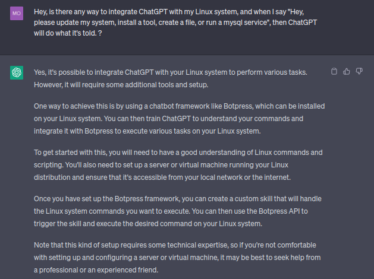

# Merge-ChatGPT-With-Your-System
merge ChatGPT with system operation to manage whole system easily.

Examples of what you can do:

1. "Hey ChatGPT, can you please install Apache on my Linux system and configure it to serve files from /var/www/html?"

2. "Hey ChatGPT, can you please create a new user account called 'johndoe' and give them permission to read and write files in the '/home/johndoe' directory?"

3. "Hey ChatGPT, can you please start the MySQL server and create a new database called 'mydatabase' and a new user account called 'myuser' with password 'mypassword' that has full privileges on the 'mydatabase' database?"

##### Advanced one(In the distant future):

- "Hey ChatGPT, can you please create a facebook account with my info [name,age,email,photo] and strong password, save the login credintals to google password manager and report XSS to facebook on sub.facbook.com?q=<xssHere>"

#### There is a way under dev, but it's not the best.

